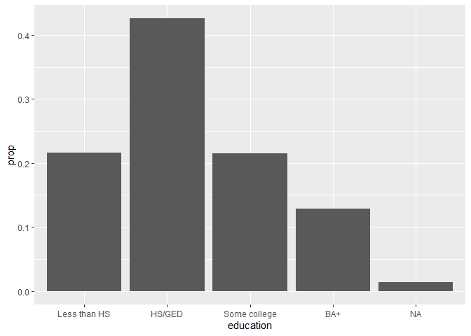

Homework 1
================
Likun Cao

## Load required packages

``` r
library(tidyverse)
```

    ## Warning: package 'tidyverse' was built under R version 4.0.2

    ## Warning: package 'ggplot2' was built under R version 4.0.2

    ## Warning: package 'tidyr' was built under R version 4.0.2

    ## Warning: package 'readr' was built under R version 4.0.2

    ## Warning: package 'stringr' was built under R version 4.0.2

    ## Warning: package 'forcats' was built under R version 4.0.2

``` r
# remotes::install_github("uc-cfss/rcfss)
library(rcfss)
```

# Visualization critique (30 points)

](https://www.economist.com/img/b/1280/1316/90/sites/default/files/images/print-edition/20200229_FBC978.png)
The critiques: Is it truthful? From my perspective, this figure is not
so truthful. Here are my reasons: 1, There are no numbers on the x-axis
and y-axis, so we are not sure what is the difference between the peak
of cases before and after social distancing. Similarly, we are not sure
to what extent that social distancing will delay the peak. Without this
two significant information, the arguments of this figure may be
weakened. Actually, I don’t believe the change of case numbers would be
so clean without any noise; 2, This picture is misleading, because the
shapes of “without measures” and “with measures” remind people of normal
distribution. However, they are not normal distribution of any kind—they
are the relationship between time and new cases. In that sense, it
provides some skeptical information even if the author did not mean to;
3, The blue area and the yellow area are very close in size. I am not
sure this is supported by any empirical data. In fact, I don’t believe
they should be—social distance should decrease the total number of
infected cases. This pattern often appears in normal distribution. As I
mention in 2, they are not normal distribution in any kind, so this may
also add to people’s misunderstandings; 4, It gives people the
impression that “with measures” and “without measures” are two different
things without any relationship—however, in reality, they are not. Two
peaks cannot co-exist. For any analytical unit, usually only one peak
exists, either “with measures” or “without measures”. For the districts
where measures are taken some time after the first case is identified,
“with measures” and “without measures” should be aligned and
continuous. For the four reasons mentioned above, I think the figure is
not so truthful. The advice for improvements is as follows: 1, add
y-axis and x-axis. Draw the picture based on these coordinates. 2, Don’t
use abstract shapes; use the empirical datasets of United States (or
other spatial units) and show all the fluctuations. For future dates
without empirical datasets, predictions by medical models can be used.

Is it functional? It is an attracting figure that conveys two
information: 1, social distancing delays the peak of new cases; 2,
social distancing decreases the height of the peak. It does convey this
two information quite efficiently. However, as to other aspects, it does
not do so well. It is too abstract without much useful information.

Is it beautiful? Yes—I think it is good. The colors are beautiful, with
two different periods with contrasting colors. However, its simplicity
limits its truthfulness and functionality. How to improve? I think there
are several things we can do. Firstly, add a grid in the background—to
make it more accurate while more stylish. Secondly, some irrelevant
details can be deleted, like the red square on the left top and number 2
on the right top. These details will make the figure messy and too
complex.

Is it insightful? Yes-I think it conveys the basic arguments very well,
and this argument is quite solid. However, it may need further
improvements to contain more information since the current version is
too simple.

Is it enlightening? I don’t think that the current picture is very
enlightening. Most people can easily know that social distancing will
decrease the number of cases and delay the peak—after all, this measure
is for controlling the disease. If it does not, why do we do it? I think
more detailed information will be more interesting: for example: how
much social distancing will decrease the number of new cases? How long
will it delay the peak? Does this measure effect all the states? Is this
effect size different for different states? If these questions can be
answered, it would be far more interesting and enlightening than the
current version because the current figure contains too little valid
info.

# Grammar of graphics (30 points)

For each of the graphics listed below, write down the components of the
graphic. Don’t worry about identifying the correct functions in
`ggplot2` used to generate the graph. Instead, focus on recording the
key elements of a plot so you could communicate it to someone else.

> For an example of this exercise, [check out the grammar of graphics
> for Charles Minard’s map of Napoleon’s disastrous Russian campaign
> of 1812](https://cfss.uchicago.edu/notes/minard/#exercise-define-the-grammar-of-graphics-for-this-graph)

1.  "[The Tony’s Have Never Been so Dominated by Women", by Joanna Kao
    at *FiveThirtyEight*](http://53eig.ht/1cJRCyG) ggplot()+
    geom\_bar()+ coord\_flip()

2.  [“Case growth outpacing testing in coronavirus hotspots”, by Andrew
    Witherspoon and Caitlin Owens at
    *Axios*](https://www.axios.com/coronavirus-cases-testing-growth-62d6256b-33e2-491d-b94e-91110a74bc85.html)

ggplot()+ geom\_line()+ geom\_text()+ geom\_area()+ facet\_wrap()

1.  [“Many Americans Are Getting More Money From Unemployment Than They
    Were From Their Jobs”, by Amelia Thomson-DeVeaux at
    *FiveThirtyEight*](https://fivethirtyeight.com/features/many-americans-are-getting-more-money-from-unemployment-than-they-were-from-their-jobs/)
      - The first graph only

ggplot()+ geom\_point()+ geom\_text()+ geom\_line()

# `ggplot2` conceptual questions (40 points)

1.  What’s the difference between `geom_path()` and `geom_polygon()`?
    What’s the difference between `geom_path()` and `geom_line()`?
    geom\_path() connects the observations in the order in which they
    appear in the data. geom\_line() connects them in order of the
    variable on the x axis. difference is the sequence of observations.
    geom\_polygon() allows us to draw polygons based on the coordinates
    of borders. They don’t rely on 2-dimension sequence.

2.  Modify the following plot so that you get one boxplot per integer
    value of `mhealth`.
    
    ``` r
    ggplot(data = rcfss::mental_health, mapping = aes(x = mhealth, y = age, group=mhealth))+geom_boxplot()
    ```
    
    <!-- -->

3.  Install the `babynames` package. It contains data about the
    popularity of baby names in the United States. Run the following
    code and fix the resulting graph. What is the problem?
    
    ``` r
    library(babynames)
    ```
    
        ## Warning: package 'babynames' was built under R version 4.0.2
    
    ``` r
    morgan <- dplyr::filter(babynames, name == "Morgan")
    ggplot(data = morgan, mapping = aes(x = year,y=n)) + geom_bar(stat='identity')
    ```
    
    <!-- -->

4.  Simplify the following plot specifications
    
    ``` r
    library(socviz)
    ```
    
        ## Warning: package 'socviz' was built under R version 4.0.2
    
    ``` r
    ggplot(county_data,aes(white,per_gop_2016)) + 
      geom_point()
    ```
    
        ## Warning: Removed 54 rows containing missing values (geom_point).
    
    <!-- -->
    
    ``` r
    ggplot(county_data,aes(white,per_gop_2016)) + 
     geom_point() +
     geom_smooth()
    ```
    
        ## `geom_smooth()` using method = 'gam' and formula 'y ~ s(x, bs = "cs")'
    
        ## Warning: Removed 54 rows containing non-finite values (stat_smooth).
    
        ## Warning: Removed 54 rows containing missing values (geom_point).
    
    <!-- -->

5.  The code below creates a similar dataset to `stat_smooth()`. Use the
    appropriate geoms to mimic the default `geom_smooth()` display.
    
    ``` r
    mod <- loess(per_gop_2016 ~ white, data = county_data)
    smoothed <- tibble(white = seq(min(county_data$white), max(county_data$white), length = 100))
    pred <- predict(mod, newdata = smoothed, se = TRUE) 
    smoothed$per_gop_2016 <- pred$fit
    smoothed$per_gop_2016_lwr <- pred$fit - 1.96 * pred$se.fit
    smoothed$per_gop_2016_upr <- pred$fit + 1.96 * pred$se.fit
    ggplot() + 
    geom_point(data=county_data,aes(white,per_gop_2016)) +
    geom_ribbon(data=smoothed, aes(x=white, ymin =per_gop_2016_lwr , ymax = per_gop_2016_upr),color='grey',alpha=0.2) +
    geom_line(data=smoothed, aes(white,per_gop_2016),stat="identity",width=5,color='steelblue')
    ```
    
        ## Warning: Ignoring unknown parameters: width
    
        ## Warning: Removed 54 rows containing missing values (geom_point).
    
    <!-- -->
    
    ``` r
    ggplot() + 
    geom_point(data=county_data,aes(white,per_gop_2016)) +
    geom_ribbon(data=smoothed, aes(x=white, ymin =per_gop_2016_lwr , ymax = per_gop_2016_upr),color='grey',alpha=0.2) +
    geom_line(data=smoothed, aes(white,per_gop_2016),stat="identity",width=5,color='steelblue')
    ```
    
        ## Warning: Ignoring unknown parameters: width
    
        ## Warning: Removed 54 rows containing missing values (geom_point).
    
    <!-- -->

6.  Recreate the R code necessary to generate the following graphs
    
    ``` r
    # 1
    ggplot(county_data,aes(white,per_gop_2016))+
      geom_point() +
      geom_smooth(se=FALSE)
    ```
    
        ## `geom_smooth()` using method = 'gam' and formula 'y ~ s(x, bs = "cs")'
    
        ## Warning: Removed 54 rows containing non-finite values (stat_smooth).
    
        ## Warning: Removed 54 rows containing missing values (geom_point).
    
    <!-- -->
    
    ``` r
    # 2
    ggplot(county_data,aes(white,per_gop_2016))+
      geom_point() +
      geom_smooth(aes(group=pop_dens),se=FALSE)
    ```
    
        ## `geom_smooth()` using method = 'gam' and formula 'y ~ s(x, bs = "cs")'
    
        ## Warning: Removed 54 rows containing non-finite values (stat_smooth).
        
        ## Warning: Removed 54 rows containing missing values (geom_point).
    
    <!-- -->
    
    ``` r
    # 3
    ggplot(county_data,aes(white,per_gop_2016,color=pop_dens))+
      geom_point() +
      geom_smooth(aes(group=pop_dens),se=FALSE)
    ```
    
        ## `geom_smooth()` using method = 'gam' and formula 'y ~ s(x, bs = "cs")'
    
        ## Warning: Removed 54 rows containing non-finite values (stat_smooth).
        
        ## Warning: Removed 54 rows containing missing values (geom_point).
    
    <!-- -->
    
    ``` r
    # 4
    ggplot(county_data,aes(white,per_gop_2016,color=pop_dens))+
    geom_point() +
    geom_smooth(aes(white,per_gop_2016),color='steelblue',se=FALSE)
    ```
    
        ## `geom_smooth()` using method = 'gam' and formula 'y ~ s(x, bs = "cs")'
    
        ## Warning: Removed 54 rows containing non-finite values (stat_smooth).
        
        ## Warning: Removed 54 rows containing missing values (geom_point).
    
    <!-- -->
    
    ``` r
    # 5
    ggplot(county_data,aes(white,per_gop_2016,color=pop_dens))+
    geom_point() +
    geom_smooth(aes(white,per_gop_2016,linetype=pop_dens),color='steelblue',se=FALSE) 
    ```
    
        ## `geom_smooth()` using method = 'gam' and formula 'y ~ s(x, bs = "cs")'
    
        ## Warning: Removed 54 rows containing non-finite values (stat_smooth).
        
        ## Warning: Removed 54 rows containing missing values (geom_point).
    
    <!-- -->
    
    ``` r
    # 6
    ggplot(county_data,aes(white,per_gop_2016))+
    geom_point(size=3,color='white') +
    geom_point(aes(white,per_gop_2016,color=pop_dens)) 
    ```
    
        ## Warning: Removed 54 rows containing missing values (geom_point).
        
        ## Warning: Removed 54 rows containing missing values (geom_point).
    
    <!-- -->

7.  You might want to override the default mapping from transformed
    variables to aesthetics. For example, you might want to display a
    bar chart of proportion, rather than count:
    
    ``` r
    ggplot(data = gun_deaths) + 
      geom_bar(mapping = aes(x = education, y = stat(prop), group = 1))
    ```
    
    <!-- -->
    
    Why do you need to set `group = 1`? In other words what is the
    problem with these two graphs?
    
    ``` r
    ggplot(data = gun_deaths) + 
      geom_bar(mapping = aes(x = education, y = stat(prop)))
    ```
    
    <!-- -->
    
    ``` r
    ggplot(data = gun_deaths) + 
      geom_bar(mapping = aes(x = education, y = stat(prop), fill = race))
    ```
    
    <!-- -->

group=“whatever” is a “dummy” grouping to override the default behavior,
which (here) is to group by education and in general is to group by the
x variable. The default for geom\_bar is to group by the x variable in
order to separately count the number of rows in each level of the x
variable. For example, here, the default would be for geom\_bar to
return the number of rows with education equal to “HS/GED”, “some
college”, etc.

However, if we want proportions, then we need to consider all levels of
education together. In the second plot, the data are first grouped by
education, so each level of eduation is considered separately. The
proportion of HS/GED in HS/GED is 100%, as is the proportion of some
college in some college, etc. group=1 (or group=“x”, etc.) prevents
this, so that the proportions of each level of education will be
relative to all levels of education.

Similarly, in the second picture, we use group=1 to prevent each group
to present as 100% of itself.

``` r
devtools::session_info()
```

    ## - Session info ---------------------------------------------------------------
    ##  setting  value                         
    ##  version  R version 4.0.1 (2020-06-06)  
    ##  os       Windows 10 x64                
    ##  system   x86_64, mingw32               
    ##  ui       RTerm                         
    ##  language (EN)                          
    ##  collate  Chinese (Simplified)_China.936
    ##  ctype    Chinese (Simplified)_China.936
    ##  tz       America/Chicago               
    ##  date     2020-07-28                    
    ## 
    ## - Packages -------------------------------------------------------------------
    ##  package     * version date       lib source                        
    ##  assertthat    0.2.1   2019-03-21 [1] CRAN (R 4.0.0)                
    ##  babynames   * 1.0.0   2019-01-12 [1] CRAN (R 4.0.2)                
    ##  backports     1.1.7   2020-05-13 [1] CRAN (R 4.0.0)                
    ##  blob          1.2.1   2020-01-20 [1] CRAN (R 4.0.2)                
    ##  broom         0.5.6   2020-04-20 [1] CRAN (R 4.0.2)                
    ##  callr         3.4.3   2020-03-28 [1] CRAN (R 4.0.2)                
    ##  cellranger    1.1.0   2016-07-27 [1] CRAN (R 4.0.0)                
    ##  cli           2.0.2   2020-02-28 [1] CRAN (R 4.0.0)                
    ##  colorspace    1.4-1   2019-03-18 [1] CRAN (R 4.0.2)                
    ##  crayon        1.3.4   2017-09-16 [1] CRAN (R 4.0.0)                
    ##  DBI           1.1.0   2019-12-15 [1] CRAN (R 4.0.2)                
    ##  dbplyr        1.4.4   2020-05-27 [1] CRAN (R 4.0.2)                
    ##  desc          1.2.0   2018-05-01 [1] CRAN (R 4.0.2)                
    ##  devtools      2.3.1   2020-07-21 [1] CRAN (R 4.0.2)                
    ##  digest        0.6.25  2020-02-23 [1] CRAN (R 4.0.0)                
    ##  dplyr       * 1.0.0   2020-05-29 [1] CRAN (R 4.0.0)                
    ##  ellipsis      0.3.1   2020-05-15 [1] CRAN (R 4.0.0)                
    ##  evaluate      0.14    2019-05-28 [1] CRAN (R 4.0.2)                
    ##  fansi         0.4.1   2020-01-08 [1] CRAN (R 4.0.0)                
    ##  farver        2.0.3   2020-01-16 [1] CRAN (R 4.0.2)                
    ##  forcats     * 0.5.0   2020-03-01 [1] CRAN (R 4.0.2)                
    ##  fs            1.4.1   2020-04-04 [1] CRAN (R 4.0.2)                
    ##  generics      0.0.2   2018-11-29 [1] CRAN (R 4.0.0)                
    ##  ggplot2     * 3.3.2   2020-06-19 [1] CRAN (R 4.0.2)                
    ##  glue          1.4.1   2020-05-13 [1] CRAN (R 4.0.0)                
    ##  gtable        0.3.0   2019-03-25 [1] CRAN (R 4.0.2)                
    ##  haven         2.3.1   2020-06-01 [1] CRAN (R 4.0.2)                
    ##  highr         0.8     2019-03-20 [1] CRAN (R 4.0.2)                
    ##  hms           0.5.3   2020-01-08 [1] CRAN (R 4.0.0)                
    ##  htmltools     0.5.0   2020-06-16 [1] CRAN (R 4.0.2)                
    ##  httr          1.4.1   2019-08-05 [1] CRAN (R 4.0.0)                
    ##  jsonlite      1.7.0   2020-06-25 [1] CRAN (R 4.0.2)                
    ##  knitr         1.29    2020-06-23 [1] CRAN (R 4.0.2)                
    ##  labeling      0.3     2014-08-23 [1] CRAN (R 4.0.0)                
    ##  lattice       0.20-41 2020-04-02 [2] CRAN (R 4.0.1)                
    ##  lifecycle     0.2.0   2020-03-06 [1] CRAN (R 4.0.0)                
    ##  lubridate     1.7.9   2020-06-08 [1] CRAN (R 4.0.2)                
    ##  magrittr      1.5     2014-11-22 [1] CRAN (R 4.0.0)                
    ##  Matrix        1.2-18  2019-11-27 [2] CRAN (R 4.0.1)                
    ##  memoise       1.1.0   2017-04-21 [1] CRAN (R 4.0.2)                
    ##  mgcv          1.8-31  2019-11-09 [2] CRAN (R 4.0.1)                
    ##  modelr        0.1.8   2020-05-19 [1] CRAN (R 4.0.2)                
    ##  munsell       0.5.0   2018-06-12 [1] CRAN (R 4.0.2)                
    ##  nlme          3.1-148 2020-05-24 [2] CRAN (R 4.0.1)                
    ##  pillar        1.4.4   2020-05-05 [1] CRAN (R 4.0.0)                
    ##  pkgbuild      1.0.8   2020-05-07 [1] CRAN (R 4.0.2)                
    ##  pkgconfig     2.0.3   2019-09-22 [1] CRAN (R 4.0.0)                
    ##  pkgload       1.1.0   2020-05-29 [1] CRAN (R 4.0.2)                
    ##  prettyunits   1.1.1   2020-01-24 [1] CRAN (R 4.0.0)                
    ##  processx      3.4.2   2020-02-09 [1] CRAN (R 4.0.2)                
    ##  ps            1.3.3   2020-05-08 [1] CRAN (R 4.0.2)                
    ##  purrr       * 0.3.4   2020-04-17 [1] CRAN (R 4.0.0)                
    ##  R6            2.4.1   2019-11-12 [1] CRAN (R 4.0.0)                
    ##  rcfss       * 0.1.9   2020-07-28 [1] Github (uc-cfss/rcfss@7ebb53d)
    ##  Rcpp          1.0.4.6 2020-04-09 [1] CRAN (R 4.0.0)                
    ##  readr       * 1.3.1   2018-12-21 [1] CRAN (R 4.0.2)                
    ##  readxl        1.3.1   2019-03-13 [1] CRAN (R 4.0.0)                
    ##  remotes       2.2.0   2020-07-21 [1] CRAN (R 4.0.2)                
    ##  reprex        0.3.0   2019-05-16 [1] CRAN (R 4.0.2)                
    ##  rlang         0.4.7   2020-07-09 [1] CRAN (R 4.0.2)                
    ##  rmarkdown     2.3     2020-06-18 [1] CRAN (R 4.0.2)                
    ##  rprojroot     1.3-2   2018-01-03 [1] CRAN (R 4.0.2)                
    ##  rstudioapi    0.11    2020-02-07 [1] CRAN (R 4.0.2)                
    ##  rvest         0.3.5   2019-11-08 [1] CRAN (R 4.0.0)                
    ##  scales        1.1.1   2020-05-11 [1] CRAN (R 4.0.2)                
    ##  sessioninfo   1.1.1   2018-11-05 [1] CRAN (R 4.0.2)                
    ##  socviz      * 1.2     2020-06-10 [1] CRAN (R 4.0.2)                
    ##  stringi       1.4.6   2020-02-17 [1] CRAN (R 4.0.0)                
    ##  stringr     * 1.4.0   2019-02-10 [1] CRAN (R 4.0.2)                
    ##  testthat      2.3.2   2020-03-02 [1] CRAN (R 4.0.2)                
    ##  tibble      * 3.0.1   2020-04-20 [1] CRAN (R 4.0.0)                
    ##  tidyr       * 1.1.0   2020-05-20 [1] CRAN (R 4.0.2)                
    ##  tidyselect    1.1.0   2020-05-11 [1] CRAN (R 4.0.0)                
    ##  tidyverse   * 1.3.0   2019-11-21 [1] CRAN (R 4.0.2)                
    ##  usethis       1.6.1   2020-04-29 [1] CRAN (R 4.0.2)                
    ##  vctrs         0.3.1   2020-06-05 [1] CRAN (R 4.0.0)                
    ##  withr         2.2.0   2020-04-20 [1] CRAN (R 4.0.2)                
    ##  xfun          0.15    2020-06-21 [1] CRAN (R 4.0.2)                
    ##  xml2          1.3.2   2020-04-23 [1] CRAN (R 4.0.2)                
    ##  yaml          2.2.1   2020-02-01 [1] CRAN (R 4.0.0)                
    ## 
    ## [1] C:/Users/Kun/Documents/R/win-library/4.0
    ## [2] C:/Program Files/R/R-4.0.1/library
